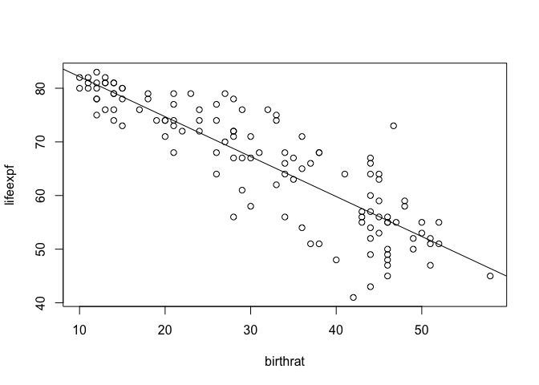

    ## Loading required package: lattice

    ## Loading required package: survival

    ## Loading required package: Formula

    ## Loading required package: ggplot2

    ## 
    ## Attaching package: 'Hmisc'

    ## The following objects are masked from 'package:base':
    ## 
    ##     format.pval, round.POSIXt, trunc.POSIXt, units

  

    ## 
    ##  Pearson's product-moment correlation
    ## 
    ## data:  lifeexpf and birthrat
    ## t = -19.204, df = 119, p-value < 2.2e-16
    ## alternative hypothesis: true correlation is not equal to 0
    ## 95 percent confidence interval:
    ##  -0.9072008 -0.8179588
    ## sample estimates:
    ##        cor 
    ## -0.8695051

    ## [1] "Expected female life expectancy:"

    ##       1 
    ## 70.9711

    ## [1] "Linear regression makes several key assumptions:1.Linear relationship 2.Multivariate normality 3.No or little multicollinearity 4.No auto-correlation 5.Homoscedasticity"

    ##          lifeexpf  gdp urban hospbed docs radio
    ## lifeexpf     1.00 0.66  0.70    0.63 0.78  0.57
    ## gdp          0.66 1.00  0.61    0.65 0.72  0.67
    ## urban        0.70 0.61  1.00    0.50 0.68  0.54
    ## hospbed      0.63 0.65  0.50    1.00 0.77  0.50
    ## docs         0.78 0.72  0.68    0.77 1.00  0.53
    ## radio        0.57 0.67  0.54    0.50 0.53  1.00
    ## 
    ## n
    ##          lifeexpf gdp urban hospbed docs radio
    ## lifeexpf      122 122   122     116  121   122
    ## gdp           122 122   122     116  121   122
    ## urban         122 122   122     116  121   122
    ## hospbed       116 116   116     116  116   116
    ## docs          121 121   121     116  121   121
    ## radio         122 122   122     116  121   122
    ## 
    ## P
    ##          lifeexpf gdp urban hospbed docs radio
    ## lifeexpf           0   0     0       0    0   
    ## gdp       0            0     0       0    0   
    ## urban     0        0         0       0    0   
    ## hospbed   0        0   0             0    0   
    ## docs      0        0   0     0            0   
    ## radio     0        0   0     0       0
